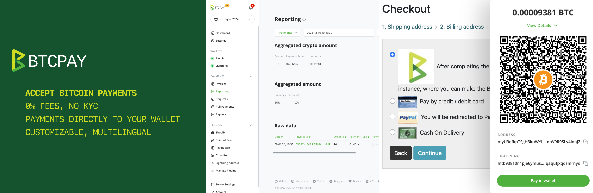

# BTCPay Server – Accept Bitcoin payments in GrandNode

## Plugin Overview

This plugin allows you to easily start accepting Bitcoin payments in your GrandNode e-commerce store using BTCPay Server — a free, self-hosted and open-source payment gateway. 

## Features

- 0% Fees: Enjoy a payment gateway with no fees. Yes, really!
- No complicated KYC needed, you're your own, self-hosted payment gateway
- Automated invoice management and refunds
- Simple and customizable checkout UX, available in 30+ languages
- Direct payments to your wallet, no intermediary
- Reporting and accounting – CSV exports
- Real-time exchange price tracking for correct payment amounts
- Community-driven support
- Extensive documentation and video tutorials

## Getting Started 

### Download and installation

The plugins can be downloaded through GrandNode Extension Directory or GitHub. 

For installing the plugin on GrandNode, you can either upload the plugin directly to the `/plugins` folder in your GrandNode main directory and restart your application, or use the Admin Panel to upload the plugin. 

In the **Admin Panel**, navigate to **Plugins -> Local Plugins** and click the **"Upload"** button. Ensure the plugin file is in ZIP for successful upload. After uploading, find the plugin in the list, click "Install" next to it, and enable it if needed​.

## Plugin configuration

You can configure the plugin either automatically or manually, depending on your preferences and requirements.

### Automatic Configuration

1. Enter Url to your BTCPay Server into "BTCPay Url" field. (e.g. https://mainnet.demo.btcpayserver.org)
2. Click on the "Configure automatically" button to be redirected to the API authorization page of your BTCPay Server
3. On the authorization page: Select the store you want to connect to your GrandNode (you might need to login first)
4. Click on "Authorize App" button and you will be redirected back to your GrandNode
3. The "API Key", "BTCPay Store ID" and "Webhook Secret" fields will be automatically filled and a webhook created
4. Click "Save" button at bottom to persist the configuration
5. Congrats, the configuration is now done.

- Note: given the architecture of GrandNode, it is possible that malfunctions in redirections may occur. Particularly if https is disabled or incorrectly configured. In this case, please opt for manual configuration.

### Manual Configuration

Ensure that the following fields are filled out: "BTCPay Url," "API Key," "BTCPay Store ID," and "WebHook Secret."

To create the **BTCPay API key**, [read this](https://docs.btcpayserver.org/VirtueMart/#22-create-an-api-key-and-configure-permissions).
- Note: If you want to use the Refund feature, you must also add the "Create non-approved pull payments" permission. After a refund, an order note is created where you can copy the pull payments link and send to your customer (this order note is also visible by the customer). The customer can request the refund on that page.

To create the **BTCPay WebHook**, [read this](https://docs.btcpayserver.org/VirtueMart/#23-create-a-webhook-on-btcpay-server) and use the default secret code generated by BTCPay.
- Note: Other than in the guide you need to copy the Url shown in field "Webhook Url" from your configuration screen on GrandNode.

BTCPay **Store ID** can be obtained from your BTCPay Server, in Store Settings > General > Store ID field.

## Support

Feel free to join our support channel over at [Mattermost](https://chat.btcpayserver.org/) or [Telegram](https://t.me/btcpayserver) if you need help or have any further questions.

If experience a bug please [open a bug report](https://github.com/btcpayserver/btcpay-grandnode-plugin/issues)

## License

This plugin is released under the [MIT License](LICENSE).

The non-profit [BTCPay Server Foundation](https://btcpayserver.org) is committed to keeping this powerful payment plugin free forever. Our mission is to enable anyone to accept bitcoin regardless of financial, technical, social or political barriers.

---